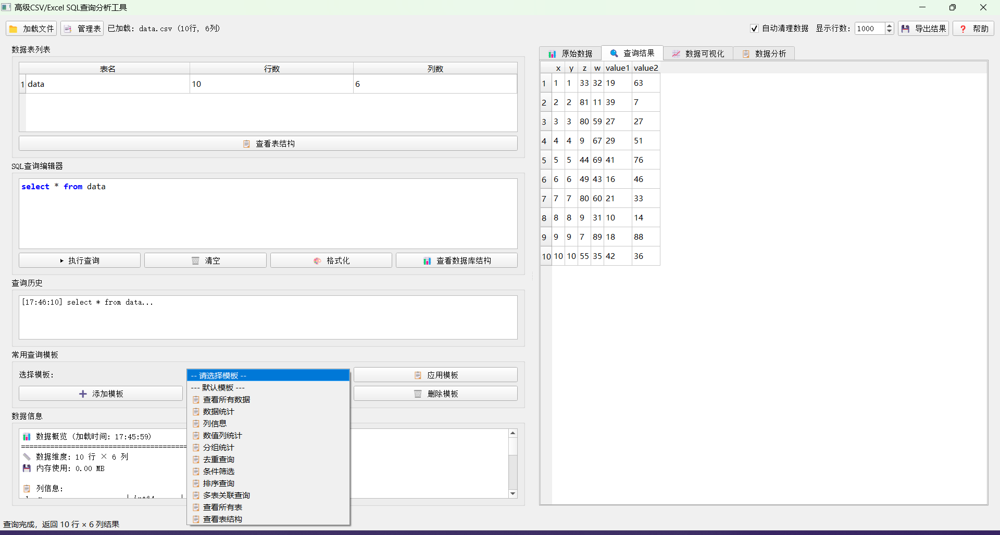
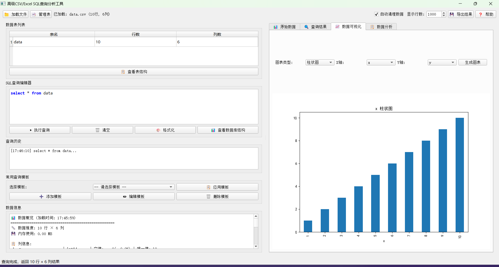

# SQL4CSV - CSV/Excel SQL查询分析工具

一个基于PyQt5的图形化工具，支持对CSV和Excel文件进行SQL查询和数据分析。省去了手动创建数据库和表的步骤，直接对文件进行查询。
让有SQL基础的人员也能够方便快捷分析表格文件。

## 主要特性

- 📊 支持CSV和Excel文件导入
- 🔍 使用DuckDB进行高性能SQL查询
- 📈 内置简单的数据可视化功能
- 📋 SQL查询模板管理
- 🔬 简单的数据分析报告
- 📑 查询结果导出

## 系统要求

- Python 3.7+
- Windows

## 安装依赖

1. 克隆或下载项目到本地
2. 安装依赖包：

```bash
pip install -r requirements.txt
```

## 主要依赖

- **DuckDB**: 高性能分析型数据库
- **PyQt5**: 图形用户界面框架
- **Pandas**: 数据处理和分析
- **Matplotlib/Seaborn**: 数据可视化

## 使用方法

1. 运行程序：

```bash
cd core
python main.py
```

2. 点击"📁 加载文件"按钮导入CSV或Excel文件
3. 在SQL编辑器中输入查询语句
4. 点击"▶️ 执行查询"运行查询
5. 查看结果和可视化图表

## 打包程序

1. 运行打包命令
```bash
pyinstaller -w -F main.py
```

2. 打包后的程序在 `dist` 目录下
3. 双击 `dist/main.exe` 运行程序


## 示例查询

```sql
-- 基本查询
SELECT * FROM data_table LIMIT 10;

-- 聚合分析
SELECT 
    category,
    COUNT(*) as count,
    AVG(price) as avg_price,
    SUM(quantity) as total_quantity
FROM sales_data 
GROUP BY category
ORDER BY total_quantity DESC;
```

## 界面展示


